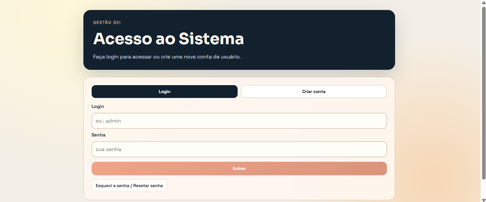
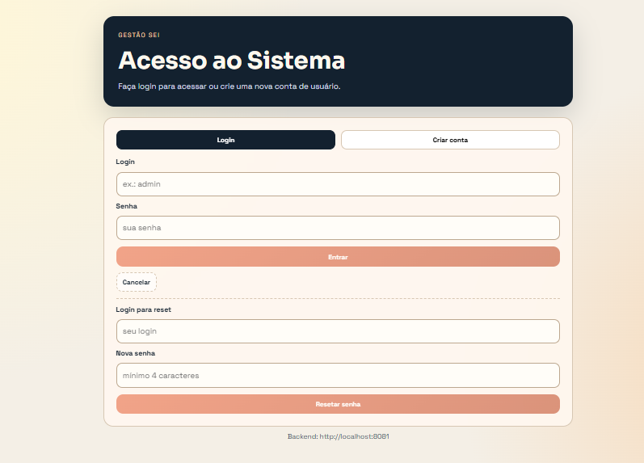
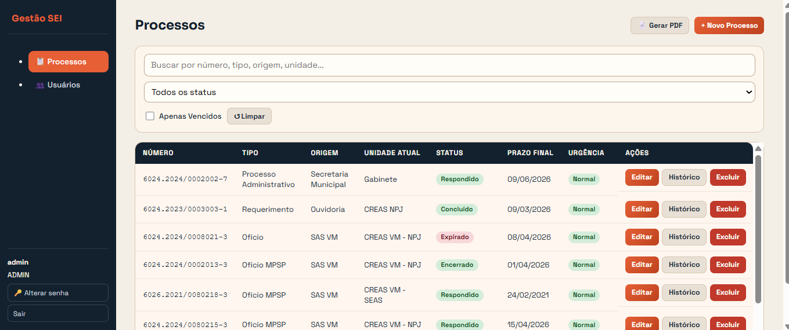
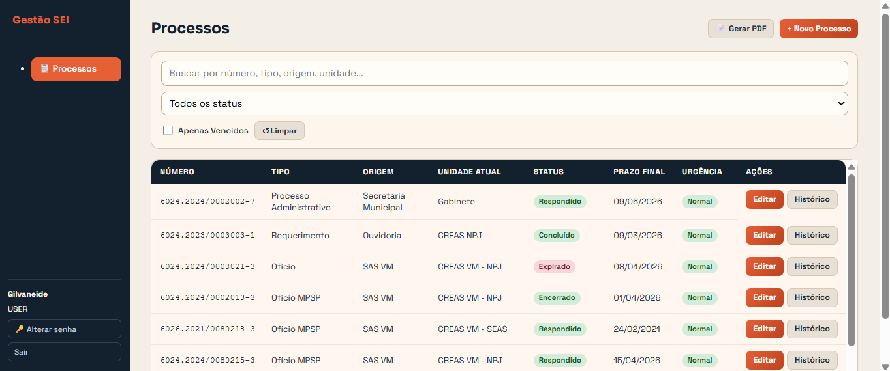
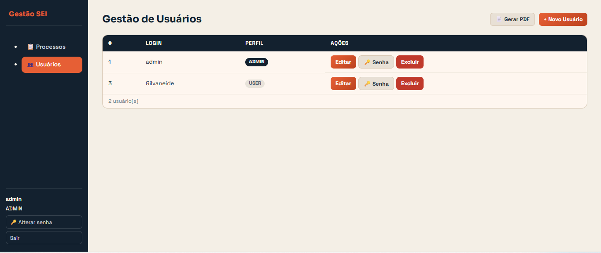
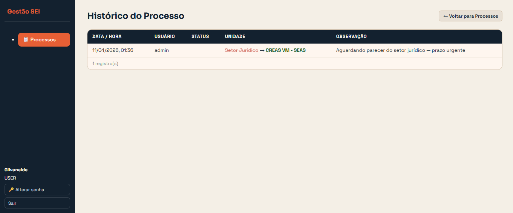

<div align="center">
  
  <h1>Gestão SEI</h1>
  <p><strong>Sistema open source para controle de prazos e tramitação de processos do SEI, desenvolvido para servidores públicos.</strong></p>
</div>

O **Gestão SEI** automatiza o acompanhamento de processos administrativos do Sistema Eletrônico de Informações (SEI), reduzindo o risco de perda de prazos e facilitando o registro histórico de tramitações.

> ℹ️ **Repositório template** — esta organização serve como base para que outros servidores possam clonar, adaptar e utilizar com os dados de sua própria instituição.

---

## 📦 Repositórios

| Repositório | Descrição | Stack |
|---|---|---|
| [gestao-sei-backend](https://github.com/GestaoSEI/gestao-sei-backend) | API REST, autenticação JWT e geração de relatórios PDF | Java 21 · Spring Boot 3.5 · PostgreSQL 16 · Docker |
| [gestao-sei-frontend](https://github.com/GestaoSEI/gestao-sei-frontend) | Interface web SPA com roteamento e controle de perfis | React 19 · TypeScript · Vite |

---

## ✨ Principais Funcionalidades

- 🔐 **Autenticação JWT** com perfis `ADMIN` e `USER`
- 📋 **CRUD de processos** com número no padrão SEI (`9999.9999/9999999-9`)
- 🔍 **Busca e filtros** por termo, status, unidade e prazo
- 📜 **Histórico automático** de tramitações (status e unidade) com usuário responsável
- ⏰ **Alertas de prazo** — sinalização de urgência e marcação automática `EXPIRADO`
- 📄 **Relatório PDF** dinâmico com filtros via JasperReports
- 👥 **Gestão de usuários** — criar, editar, excluir e redefinir senhas
- 📥 **Importação de CSV** — integração de planilha existente com detecção automática de duplicatas

---

## 🖼️ Telas do Sistema

### Acesso ao Sistema


<details>
<summary>Ver mais telas</summary>

### Recuperação de Senha


### Gestão de Processos — Perfil ADMIN


### Gestão de Processos — Perfil USER


### Gestão de Usuários


### Histórico de Processos


</details>

---

## 🚀 Como Executar

**Pré-requisitos:** Docker, Docker Compose, Node.js 20+

```bash
# 1. Backend
git clone https://github.com/GestaoSEI/gestao-sei-backend.git
cd gestao-sei-backend
docker-compose up --build -d

# 2. Frontend
git clone https://github.com/GestaoSEI/gestao-sei-frontend.git
cd gestao-sei-frontend
npm install && npm run dev
```

Acesse **http://localhost:5173** · Login inicial: `admin` / `admin123`

---

## 📄 Licença

MIT License — veja o arquivo LICENSE em cada repositório:
[gestao-sei-backend/LICENSE](https://github.com/GestaoSEI/gestao-sei-backend/blob/main/LICENSE) · [gestao-sei-frontend/LICENSE](https://github.com/GestaoSEI/gestao-sei-frontend/blob/main/LICENSE)

---
Made with ❤️ by Gilvaneide Medeiros
